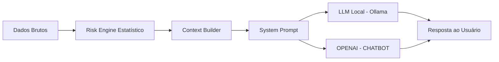

# 🛡️ Fortis — Agente Financeiro Inteligente com IA Generativa

## 📌 Visão Geral

O **Fortis** é um **Agente Financeiro Inteligente** projetado para atuar como um **Guardião Financeiro** — não como um consultor de investimentos.

Ele combina **análises estatísticas determinísticas** com **IA Generativa** para identificar riscos financeiros, interpretar comportamentos e orientar o usuário de forma **educativa, preventiva e segura**, evitando alucinações e decisões automatizadas.

O projeto foi desenvolvido com foco em:
- Arquitetura moderna de agentes
- Controle rigoroso de contexto
- Separação entre lógica e geração de linguagem
- Execução local de LLM (Ollama)

---

## 🎯 Caso de Uso

**Problema:**  
Clientes frequentemente não percebem riscos em seu comportamento financeiro, como gastos excessivos, baixa reserva, instabilidade de fluxo ou possíveis sinais de fraude.

**Solução:**  
O Fortis atua como um **guardião financeiro proativo**, analisando dados financeiros e explicando riscos e impactos de forma clara, sem realizar recomendações diretas de investimento.

**Exemplos de atuação:**
- Alerta de comprometimento excessivo da renda
- Identificação de comportamento financeiro impulsivo
- Sinais estatísticos de risco de fraude
- Fragilidade da reserva de emergência
- Orientação educativa antes de decisões financeiras relevantes

---

## 🧠 Arquitetura Geral

O Fortis segue uma arquitetura **Agent-first**, com responsabilidades bem definidas:



## 🧱 Componentes Principais

| Camada | Responsabilidade |
|------|------------------|
| **Risk Engine** | Análises estatísticas determinísticas |
| **Context Builder** | Síntese e normalização do contexto |
| **System Prompt** | Persona, regras e limites do agente |
| **LLM (Ollama)** | Geração de linguagem natural |
| **LLM (OPENAI)** | Geração de linguagem natural |
| **Streamlit UI** | Interface e controle de fluxo |

---

## 🧮 Risk Engine (Determinístico)

Toda a análise crítica ocorre **fora do LLM**, garantindo previsibilidade, rastreabilidade e segurança.

### Módulos implementados (`src/risk_engine`)

#### `fraud_detection.py`
- Identifica valores fora do padrão
- Detecta horários incomuns de transação
- Aponta ocorrências de saldo negativo

#### `credit_risk.py`
- Avalia comprometimento da renda
- Verifica suficiência da reserva de emergência

#### `financial_profile.py`
- Classifica o comportamento financeiro  
  *(ex: controlado, moderado, impulsivo)*

> 📌 **O LLM nunca recebe dados brutos**.  
> Apenas os **resultados consolidados** dessas análises são enviados para geração de linguagem.

---

## 🧩 Context Builder

O **Context Builder** (`src/agent/context_builder.py`) é responsável por:

- Transformar análises estatísticas em linguagem estruturada
- Garantir um contexto **fechado e controlado**
- Reduzir uso de tokens e latência
- Prevenir alucinações do modelo

> O modelo recebe **somente dados sintetizados**, nunca históricos completos ou dados sensíveis.

---

## 🧠 System Prompt — Fortis

O comportamento do agente é governado por um **System Prompt forte** (`src/agent/system_prompt.py`), que define:

### Persona
- **Guardião Financeiro**

### Nome
- **Fortis**

### Linguagem
- Didática
- Respeitosa
- Preventiva

### Proibições explícitas
- ❌ Recomendações de investimento
- ❌ Decisões financeiras diretas

### Foco principal
- Explicar riscos financeiros
- Educar o usuário
- Orientar de forma preventiva e consciente

---

## 🤖 Modelo de IA (LLM)

### Escolha Técnica

- **Modelo:** `mistral:7b`
- **Execução:** Local via Ollama
- **Endpoint:** `/api/generate`
---
- **Modelo:** `Openai`
- **Execução:** Cloud via Chatbot Openai
- **Autenticação:** `API_KEY`

### Justificativa

- Melhor aderência ao System Prompt
- Menor tendência a improvisar conselhos
- Mais previsível para agentes com regras rígidas
- Adequado para ambientes financeiros regulados

> O modelo *Ollama instruct* foi evitado por apresentar maior risco de ignorar restrições de comportamento.

---

## 🔒 Segurança e Anti-Alucinação

### Medidas adotadas

- Lógica crítica executada fora do LLM
- Contexto fechado e controlado
- System Prompt com regras explícitas
- Nenhum dado sensível ou histórico completo enviado ao modelo
- Execução local (sem chamadas externas)

### Variáveis de ambiente recomendadas para o LLM OLLAMA

```bash
# No PowerShell
setx OLLAMA_MAX_LOADED_MODELS=1
setx OLLAMA_NUM_PARALLEL=1
setx OLLAMA_KEEP_ALIVE=5m

# Para computador de 4 núcleo
setx OLLAMA_NUM_THREADS 4

## 🖥️ Interface (Streamlit)

A aplicação utiliza **Streamlit** ('src/app/api.py' ou 'src/app/api_openai.py') para:

- Seleção de investidor
- Execução das análises financeiras
- Visualização do contexto gerado
- Interação controlada com o agente **Fortis**
- Proteção contra múltiplas chamadas simultâneas ao modelo

### Controles de Segurança da Interface

A interface impede explicitamente:

- Perguntas sem contexto previamente gerado
- Chamadas concorrentes ao LLM
- Envio duplicado de requisições durante processamento
```
---

## 📂 Estrutura do Projeto

```text
📁 dio-lab-bia-do-futuro/
│
├── README.md
├── requirements.txt
│
├── assets/
│
├── data/
│   ├── raw/
│   │   ├── perfil_investidor.json
│   │   ├── transacoes.csv
│   │   └── movimentacoes.csv
│   └── processed/
│
├── docs/
│   ├── 01-documentacao-agente.md
│   ├── 02-base-conhecimento.md
│   ├── 03-prompts.md
│   ├── 04-metricas.md
│   └── 05-pitch.md
│
├── examples/
│
└── src/
│   ├── app/
│   │   └── api.py
|   |   |__ api_openai.py
|   |   |__ api_pc_fraco.py
│   │
│   ├── agent/
│   │   ├── context_builder.py
│   │   ├── system_prompt.py
│   │   ├── ollama_agent.py
│   │   ├── ollama_agent_pc_fraco.py
│   │   ├── openai_agent.py
│   │   
│   │
│   ├── preprocessing/
│   ├── ingestion/
│   └── risk_engine/
```

## 📊 Avaliação e Métricas

O agente **Fortis** é avaliado com base nos seguintes critérios:

- Coerência com o perfil do investidor  
- Aderência rigorosa ao **System Prompt**  
- Ausência de alucinações  
- Clareza e didatismo das respostas  
- Consistência entre o risco identificado e a orientação fornecida  

---

## 🚀 Diferenciais do Projeto

- ✔️ Arquitetura real de agente (não apenas chatbot)
- ✔️ Separação clara entre lógica determinística e geração de linguagem
- ✔️ Segurança por design
- ✔️ Modelo local controlado
- ✔️ Contexto minimalista e eficiente
- ✔️ Pronto para escalar para múltiplos agentes especializados

---

## 🏁 Considerações Finais

O **Fortis** demonstra como a IA Generativa pode ser aplicada de forma **responsável** no setor financeiro, atuando como **suporte cognitivo e educativo** — sem substituir decisões humanas.

Este projeto serve como uma **base sólida para agentes financeiros de produção**, respeitando limites técnicos, legais e éticos.

## Tags:

**Primeira versão estável:** v1.0.0
